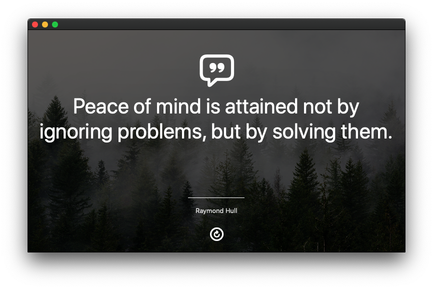

# Axiom for macOS
> Your Daily Motivational Quote App for macOS.

Built using Swift and Objective-C, Axiom provides daily reminders to help people overcome adversity, persevere, and achieve their goals. 



## Installation
Clone the git repo:
```sh
git clone git@github.com:itsandrewhong/Axiom-macOS.git
```

<!-- ## To-Dos -->


<!-- ## Release History -->

## Meta
- Andrew Hong – hello@andrewhong.tech
- Distributed under the MIT license. See ``LICENSE`` for more information.
- [https://github.com/itsandrewhong/Axiom-macOS](https://github.com/itsandrewhong/)

## Contributing
1. Fork it (<https://github.com/itsandrewhong/Axiom-macOS/fork>)
2. Create your feature branch (`git checkout -b feature/fooBar`)
3. Commit your changes (`git commit -am 'Add some fooBar'`)
4. Push to the branch (`git push origin feature/fooBar`)
5. Create a new Pull Request

<!-- Markdown link & img dfn's -->
[npm-image]: https://img.shields.io/npm/v/datadog-metrics.svg?style=flat-square
[npm-url]: https://npmjs.org/package/datadog-metrics
[npm-downloads]: https://img.shields.io/npm/dm/datadog-metrics.svg?style=flat-square
[travis-image]: https://img.shields.io/travis/dbader/node-datadog-metrics/master.svg?style=flat-square
[travis-url]: https://travis-ci.org/dbader/node-datadog-metrics